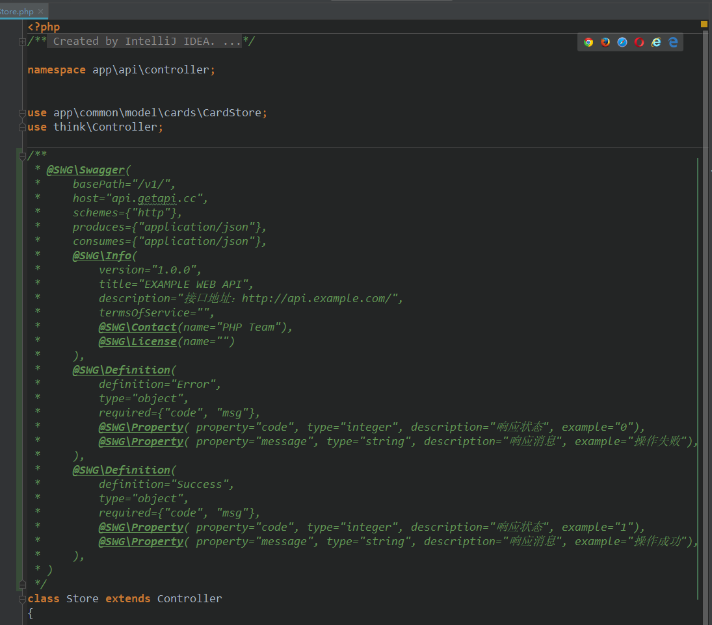
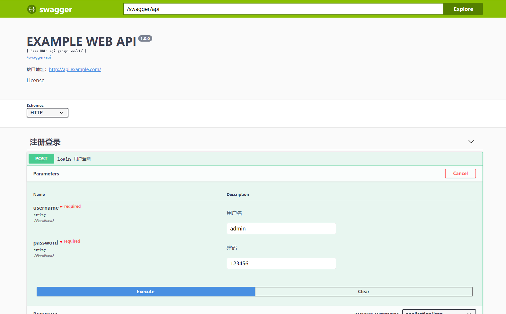

# think-swagger
The ThinkPHP5 swagger
Swagger composer模块 

thinkphp 5.0的版本可以是用：https://github.com/westhack/think-swagger

这个版本是兼容了5.1后的版本
## 

## 安装

### 一、执行命令安装
```
composer require zhaojunlike/think-swagger
```

## 使用

#### 添加配置文件
 1. 默认配置在 config 下面的 swagger.php
 2. 需要自己的配置将 config  下面的 swagger.php 复制到 extra 目录下面（或者通过下面 console 添加配置文件）
 

#### 使用方法

#### 初始化项目资源
  > 在项目目录下面找到 command.php 添加控制台添加下面配置
```
    return [
        'westhack\swagger\SwaggerAssetRegister'
    ];
  
```
  > 执行 console 命令初始化 assets 资源 
```
    php think swaggerAssetRegister   ## 默认资源目录
    php think swaggerAssetRegister --path /public/static   ## 绝对路径
    php think swaggerAssetRegister --path swagger/ui   ## 默认资源目录下面的路径
  
```
  > 执行 console 命令初始化 config 配置
```
    php think swaggerAssetRegister --config y   ## 初始化 config 配置
```

#### 访问
```
    http://你的域名/index.php?s=swagger/ui ## swagger ui
    http://你的域名/index.php?s=swagger/api ##  swagger json
    http://你的域名/index.php?s=swagger/api&clear-cache ## 清除缓存（如果开启缓存）
```

#### 在php文件中添加注释
```
/**
 * @SWG\Info(title="My First API", version="0.1")
 */

/**
 * @SWG\Get(
 *     path="/api/resource.json",
 *     @SWG\Response(response="200", description="An example resource")
 * )
 */
```

## 如图


